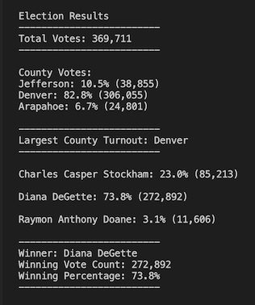
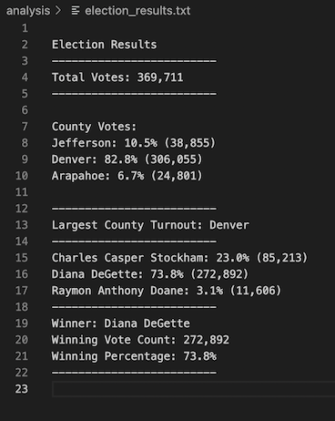
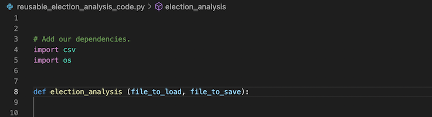
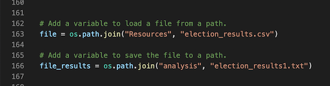
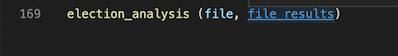

# Election-Analysis

## Project Overview     

The purpose of this project is to use Python and Visual Studio Code to audit a recent Colorado Congressional Election in order to find out the winner candidate and the county with the largest turnout.

## Analysis

In order to analyze and audit the election, a script of code was written on Visual Studio Code where data was extracted from a .csv file and then multiple functions and methods were used and variables declared. This allowed to find out the name of the counties, the number of votes and its percentage against the total, as well as a separate section to present the county with the largest turnout of votes. In addition, the name of the candidate were also extracted, the percentage and number of votes, and also a designated space to display the winner candidate with his/hers respective results.

## Results 

### Election Audit Results 

After the analysis was done the results were shown on the command line and saved on the text file.

#### Results Printed on Command line

The image below shows the results of election audit printed on the command line.

#### Results Saved on the Text File

The following image presents the election audit results saved on the election_results text file.

### Election Audit Summary

The analysis of the election shows that: 
- There were 369,711 votes cast in the election.
- The counties were:
    - Jefferson
    - Denver
    - Arapahoe

- The county results are:
    - Jefferson county had 10.5% of the vote and 38,855 number of votes.
    - Denver county had 82.8% of the vote and 306,055 number of votes.
    - Arapahoe county had 6.7% of the vote and 24,801 number of votes.

- The county with the largest turnout was:
    - Denver

- The candidates were: 
    - Charles Casper Stockham
    - Diana DeGette
    - Raymon Anthony Doane

- The candidate results were:
    - Charles Casper Stockham received 23.0% of the vote and 85,213 number of votes.
    - Diana DeGette received 73.8% of the vote and 272,892 number of votes.
    - Raymon Anthony Doane received 3.1% of the vote and 11,606 number of votes.

- The winner of the election was: 
    - Candidate Diana DeGette, who received 73.8% of the vote and 272,892 number of votes.

## Resources

- Data Source: election_results.csv
- Software: Python 3.7.6, Visual Studio Code, 1.63.2

## Challenge Overview

The act of reusing code is a great practice for any given project that is being run. New functions can be created in order to break large blocks of code into smaller and more manageable sections that can be reused.

### Challenge Summary

In order to make the election analysis code reusable for any election a new function was created and a few adjustments and modifications were performed to the code:

 - At the first line of code a function called "election_analysis" was created using the "def" keyword;
 - The parameters "file_to_load" and "file_to_save" were defined inside the parentheses;
 - All the code was indented one tab to the right, to be "inside" the new function.
 - Then the dependencies "import cvs" and "import os" were cut out from the inside the function and pasted before the line where the function was created, and indented all the way to the left.

 These changes are represented on the image below:

 - The variables "file_load" and "file_to_save", that are used to load and save a file to a given path, were also cut out from the inside of the function and pasted at the very end of the code file, and indented all the way to the left in order to move them to the outside of the new function.
 - The name os these two files were changed to "file and "file_results".

The following image shows this adjustments:

Now that the new function was created and the code was adjusted, the code inside the file can be reused for any election audit, as long as:
- The ".csv" file has the same structure (ballot ID, county, candidate)
- The "file" and "file_results" variables at the end of the code are adjusted to load and save the code to the ".csv" and ".txt" files, that represent the given election analyses to be audited.

The line of code on the next image is the new function to be used whenever there is an election to be audited:

This will save a lot of time on creating a whole new set of code to analyze an elections, making it more efficient, making testing easier and improving the speed of execution of the code!

